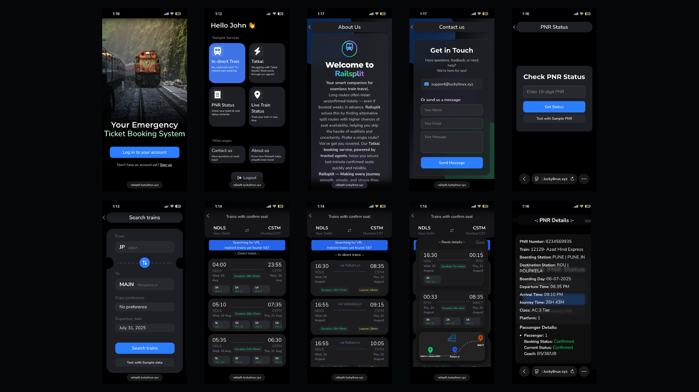

# 🚂 Railsplit Frontend

A modern frontend built with **React + Vite** for **Railsplit**, an app that helps Indian train travelers discover split journeys with better seat availability.


---

## 🎯 Features

- 🔍 Search optimized split train journeys.
- 🚀 Super fast and responsive with Vite.
- 🎨 Clean, dark-themed UI with intuitive UX.
- 🌐 Connects seamlessly with the Railsplit backend API (My own API).

---

## 🛠️ Tech Stack

- ⚛️ **React**
- ⚡ **Vite**
- 🎨 **TailwindCSS**
- 🐳 **Docker**
- ⚡ **FastAPI**
- ☁️ **Cloudflare Pages** (Hosting)

---

## 🚀 Live Demo

👉 **[railsplit.luckylinux.xyz](https://railsplit.luckylinux.xyz)**

---

## 🖼️ Screenshots


---

## 🗒️ Version History

| Version            | Description                       |       Date       |
|--------------------|-----------------------------------|------------------|
|   `v1.0.0-beta`    | 🚀 First public beta release      |  July 1st, 2025  |
|     `v1.0.0`       | 🎉 Initial stable release         |  July 10th, 2025 |

**Current Version:** `v1.0.0`

---

## 🚀 Getting Started

### Clone the Repository
```bash
git clone https://github.com/KALI-THE-HACKER/railsplit-frontend.git
cd railsplit-frontend
```

### Install Dependencies
```bash
npm install
```

### Run locally
```bash
npm run dev
```

---

## 🔑 Environment Variables
```env
VITE_RAILSPLIT_API_KEY= here's your API key for railplit's backend
```

---

## 🤝 Contributing

Contributions, issues, and suggestions are welcome!

- Fork the repository
- Create a new branch (`git checkout -b feature-name`)
- Commit your changes
- Push to the branch (`git push origin feature-name`)
- Open a Pull Request

---

## 📜 License

MIT License © [luckylinux](https://github.com/KALI-THE-HACKER)
